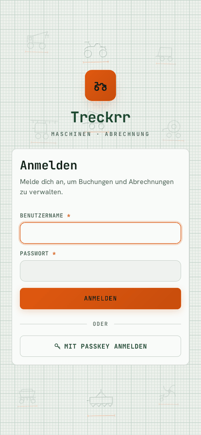
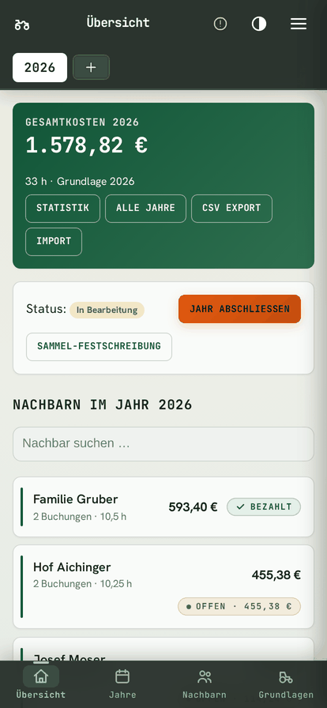
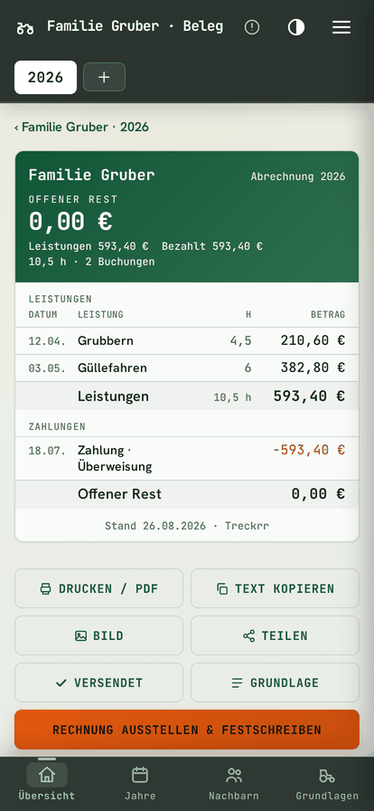
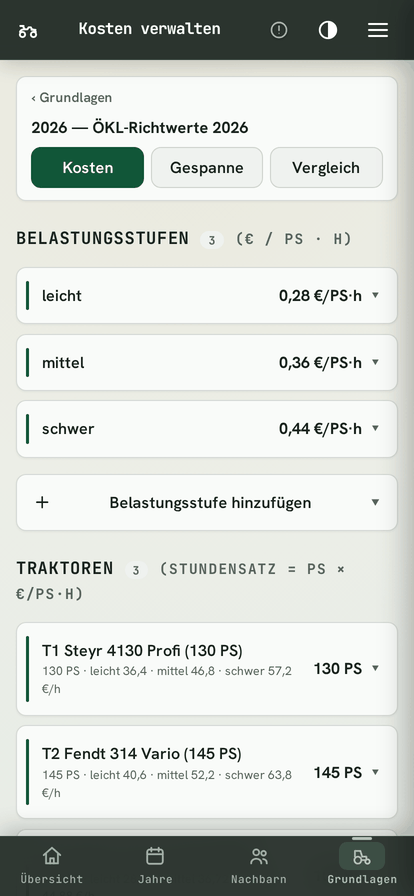
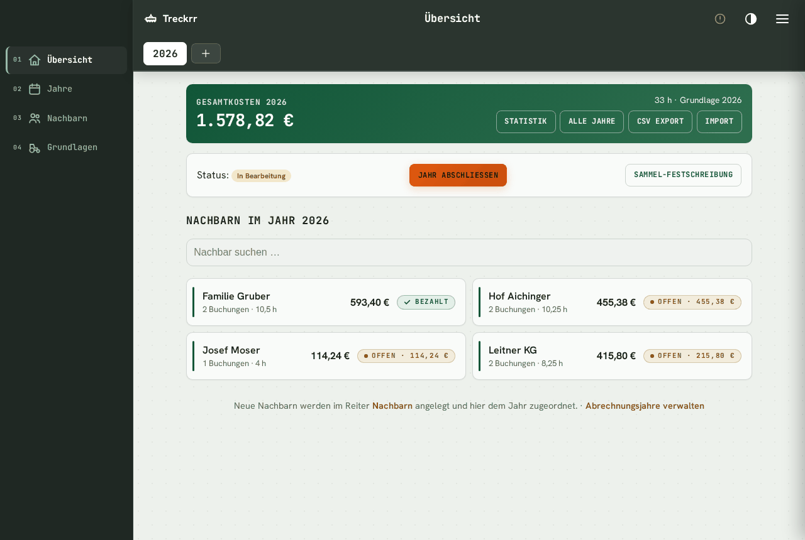

<div align="center">


# Treckrr

**Self-hosted cost-sharing ledger for agricultural machinery** — neighbours book each
other's tractors and implements, Treckrr prices the work from a shared rate basis and
issues tax-correct Austrian invoices. Go, PostgreSQL, Docker.

[](https://github.com/d0linger/treckrr/actions/workflows/ci.yml)
[](https://github.com/d0linger/treckrr/actions/workflows/security.yml)
[](LICENSE)


</div>

Treckrr is for a **Maschinengemeinschaft**: a handful of neighbouring farms that share
machinery and settle up once a year. Bookings are priced from one agreed rate basis, so
nobody argues about the hourly rate, and the year closes with a frozen invoice per
neighbour that satisfies § 11 UStG.

> The application UI is in **German**; this README is in English.
>
> All assets are served **locally** — no CDNs, no tracking, strict CSP. Your data stays
> on your machine.

---

## 📸 Screenshots

> The screenshots follow your theme automatically — **light on GitHub's light theme, dark on its dark theme**.

<table>
<tr>
<td align="center"><b>Anmelden</b></td>
<td align="center"><b>Übersicht</b></td>
<td align="center"><b>Beleg</b></td>
<td align="center"><b>Grundlage</b></td>
</tr>
<tr>
<td><picture><source media="(prefers-color-scheme: dark)" srcset="docs/img/login-m-dark.png"></picture></td>
<td><picture><source media="(prefers-color-scheme: dark)" srcset="docs/img/dashboard-m-dark.png"></picture></td>
<td><picture><source media="(prefers-color-scheme: dark)" srcset="docs/img/beleg-m-dark.png"></picture></td>
<td><picture><source media="(prefers-color-scheme: dark)" srcset="docs/img/grundlagen-m-dark.png"></picture></td>
</tr>
</table>

<p align="center"><b>Jahresübersicht</b> — every neighbour's hours, cost and payment state for the billing year, with batch invoicing and CSV export</p>
<p align="center"><picture><source media="(prefers-color-scheme: dark)" srcset="docs/img/dashboard-dark.png"></picture></p>

---

## ✨ Features

- **Bookings** priced from a shared rate basis — tractor PS × load level, or per unit/area — with implements, rigs ("Gespanne"), receipt photos, recurring series, quick capture, copy-from-existing, a duplicate warning, and storno that voids without deleting.
- **Rate bases** per year: tractors, load levels, implements and rigs. Compare two bases side by side, and lock one so its prices stop moving.
- **Recalculation**: after a rate change, preview every affected booking old → new and apply it in one step. Bookings on an already-issued invoice are left alone.
- **Billing years** per neighbour with ledger positions, partial payments (7-day undo), carry-forward between years, carrying members over from last year, plus archiving and GDPR anonymisation.
- **Invoices** frozen at issue time (§ 11 UStG snapshot) with sequential numbering, storno, credit notes, PDF, EPC QR code and optional e-mail with send tracking. **Sammel-Festschreibung** issues a whole year at once, showing per neighbour what would be issued, blocked or skipped.
- **Austrian VAT modes**: Kleinunternehmer (no VAT shown), flat-rate § 22, or standard taxation — company data, IBAN and payment terms flow into every document.
- **Public receipt links** — expiring, revocable, hash-stored tokens so a neighbour can view their invoice without an account.
- **Account statement** per neighbour across all years, as a page and as PDF.
- **Dunning** (Mahnwesen): overdue list, printable reminder, PDF, EPC QR, CSV export.
- **Import/export**: CSV bookings with preview, bank statement payment matching, per-neighbour GDPR export, year and neighbour CSV.
- **Authentication**: password + optional TOTP with recovery codes, passkeys (WebAuthn, user verification required), roles (admin / editor / viewer), and session management with per-device revocation.
- **Append-only audit log** enforced by a database trigger, filterable and exportable, with staggered retention (1 year operational, 7 years for § 132 BAO records).
- **Encrypted backups** (AES-256-GCM) on a schedule, optional off-box S3 target, upload-and-validate before restoring, and a CLI restore that puts the app into maintenance mode.
- **PWA** with offline booking capture that replays under the user who captured it when the connection returns.
- Full-text search with typo tolerance, statistics per year and across all years, light/dark theme, Prometheus metrics (opt-in).

Server-rendered Go templates with vanilla JS — no frontend build step, no CDN, strict CSP.

## 🚀 Quickstart (Docker Compose)

```bash
git clone https://github.com/d0linger/treckrr.git && cd treckrr
cp .env.example .env
```

Generate the secrets and put them in `.env`:

```bash
openssl rand -hex 32   # SESSION_SECRET
openssl rand -hex 32   # BACKUP_ENCRYPTION_KEY (optional, enables backups)
```

Set at minimum **SESSION_SECRET**, **ADMIN_PASSWORD** and **POSTGRES_PASSWORD** — and put the same database password inside **DATABASE_URL**. The app refuses to start while any of them still holds the documented placeholder value.

```bash
docker compose up -d
```

Open **http://localhost:8080** and log in as `admin`. You are forced to change the bootstrap password on first login.

**Prebuilt image instead of building locally** (multi-arch, amd64 + arm64):

```bash
docker compose -f docker-compose.ghcr.yml up -d
```

Pin a release rather than tracking `latest` with `TRECKRR_TAG=1.4`.

---

## ⚙️ Configuration / Environment Variables

| Variable | Description | Default | Required |
| --- | --- | --- | --- |
| **DATABASE_URL** | Postgres DSN (URL or keyword/value form) | — | Yes |
| **SESSION_SECRET** | Signing key, min. 32 chars, not the placeholder | — | Yes |
| **ADMIN_PASSWORD** | Bootstrap admin password, changed at first login | — | Yes |
| **POSTGRES_PASSWORD** | Database password; must match `DATABASE_URL` | — | Yes |
| **POSTGRES_USER** / **POSTGRES_DB** | Database role and name | `treckrr` | No |
| **ADMIN_USERNAME** | Bootstrap admin login name | `admin` | No |
| **APP_PORT** | Port inside the container | `8080` | No |
| **HOST_PORT** | Published port on the host | `8080` | No |
| **HOST_BIND** | Host interface to bind; use `127.0.0.1` when the proxy is local | `0.0.0.0` | No |
| **COOKIE_SECURE** | Force the `Secure` cookie flag (set behind HTTPS) | `false` | No |
| **TRUST_PROXY** | Honour `X-Forwarded-For` / `-Proto` from a reverse proxy | `false` | No |
| **TRUSTED_PROXIES** | Comma-separated CIDRs allowed to set forwarded headers | — | No |
| **ENCRYPTION_SECRET** | Data-at-rest key for TOTP secrets; pin to the OLD value before rotating `SESSION_SECRET` | `SESSION_SECRET` | No |
| **RP_ID** / **RP_ORIGIN** | WebAuthn relying party host and origin; must match the browser URL | `localhost` / `http://localhost:8080` | No |
| **ADMIN_PASSWORD_RESET** | Break-glass: reset the admin password on next boot | `false` | No |
| **BACKUP_ENCRYPTION_KEY** | Min. 16 chars; empty disables backups entirely | — | No |
| **BACKUP_DIR** / **BACKUP_STATUS_FILE** | Dump directory and status file | `/backups` | No |
| **BACKUP_KEEP** | Number of dumps to retain | `7` | No |
| **S3_ENDPOINT** / **S3_BUCKET** | Off-box backup target; empty disables it | — | No |
| **S3_ACCESS_KEY** / **S3_SECRET_KEY** / **S3_PREFIX** | S3 credentials and key prefix | — | No |
| **S3_USE_SSL** | TLS for the S3 endpoint | `true` | No |
| **SMTP_HOST** / **SMTP_FROM** | E-mail delivery; both must be set to enable it | — | No |
| **SMTP_PORT** / **SMTP_USER** / **SMTP_PASSWORD** | SMTP credentials | `587` | No |
| **SMTP_STARTTLS** | Use STARTTLS | `true` | No |
| **METRICS_TOKEN** | Min. 16 chars; enables `GET /metrics` behind a bearer token | — | No |
| **LOG_FORMAT** / **LOG_LEVEL** | `text`\|`json`, `debug`\|`info`\|`warn`\|`error` | `text` / `info` | No |

The backup schedule is a cron expression set in the admin Backup panel, not an environment variable.

---

## 💾 Prerequisites & Data Volumes

- **Docker** with Compose v2. No Go, Node or Postgres needed on the host — everything builds and runs in containers.
- **RAM**: the compose files cap the app at 768 MB and Postgres at 1 GB, so keep ~1.8 GB free. Idle use is roughly 15 MB and 31 MB.
- **Port 8080** published on the host (`HOST_PORT`). The database port is not published.
- Migrations run automatically at startup and are forward-only — **take a backup before upgrading**.

Persist these two named volumes:

| Volume | Contents |
| --- | --- |
| `pgdata` | PostgreSQL data directory — all business data |
| `backups` | Encrypted dumps and `status.json` |

Backups next to the database are not backups: set the **S3_\*** variables, or sync the `backups` volume to another machine.

**Restore** is deliberately CLI-only and asks for typed confirmation:

```bash
docker compose run --rm app restore --test <file.dump.enc>   # validate only
docker compose run --rm app restore <file.dump.enc>          # overwrites the live database
```

---

## 🧮 Cost calculation

A booking is priced from the rate basis, not typed in by hand. The tractor
contributes its power at the load level chosen for the job; every implement on the
rig adds its working width:

```
tractor rate  =  PS            ×  cost per PS   (of the load level)
machine rate  =  working width ×  cost per AB
rig rate      =  tractor rate  +  Σ machine rates
booking cost  =  hours         ×  rig rate
```

Worked example — a 130 PS tractor at load level *mittel* (0.36 €/PS) pulling a 3.0 m
power harrow (14.50 €/m), for 4.5 hours:

```
tractor   130 × 0.36  =  46.80 €/h
harrow    3.0 × 14.50 =  43.50 €/h
rig                   =  90.30 €/h
booking   4.5 × 90.30 = 406.35 €
```

Jobs that aren't billed by the hour use a **unit** instead — hectares, cubic
metres, a flat charge — with quantity × unit price.

Every step is exact decimal arithmetic rounded to two places, never binary
floating point, so totals reconcile to the cent. The cost model lives in
`internal/calc` and is unit-tested against the values from the original
spreadsheet the app replaced.

Changing a rate later does **not** silently reprice past bookings. They keep the
price they were booked at; the **Recalculation** view shows every affected booking
old → new so the change is applied deliberately.

---

## 👥 Roles & permissions

Every account has exactly one role. There is no per-object sharing — this is a
single-tenant app where everyone who signs in sees the whole ledger.

| Role | Can | Cannot |
| --- | --- | --- |
| **admin** | everything, plus users, company data, audit log and backups | — |
| **editor** | create and edit bookings, neighbours, rate bases, invoices, payments | reach anything under `/admin` |
| **viewer** | read everything, export CSV/PDF | any change except to their own account (password, 2FA, passkeys, sessions) |

A viewer's write attempt is refused server-side, not just hidden in the UI. An
admin can reset another user's password or 2FA; both end that user's sessions
immediately.

---

## 📈 Health, readiness & metrics

| Endpoint | Auth | Purpose |
| --- | --- | --- |
| `GET /livez` | public | Process is alive. **No database call** — a DB outage must not make an orchestrator kill a healthy container. |
| `GET /readyz` | public | App **and** database reachable. Returns 503 during a restore. |
| `GET /healthz` | public | Legacy alias of `/readyz`. |
| `GET /metrics` | Bearer token | Prometheus text format. Only registered when **METRICS_TOKEN** is set and at least 16 characters. |

The container's own `HEALTHCHECK` polls `/healthz` every 30 s.

Metrics cover process state (`treckrr_uptime_seconds`, `go_goroutines`,
`go_memstats_*`) and the connection pool — `treckrr_db_connections_open`,
`_in_use`, `_idle`, `_max_open`, plus `treckrr_db_wait_total` and
`treckrr_db_wait_seconds_total`. Those two are the ones to alert on: they only
move when requests are queuing for a connection.

```bash
curl -H "Authorization: Bearer $METRICS_TOKEN" http://localhost:8080/metrics
```

---

## 🌐 Running behind a reverse proxy

Forward the standard headers and tell the app to trust them:

```
proxy_set_header Host              $host;
proxy_set_header X-Real-IP         $remote_addr;
proxy_set_header X-Forwarded-For   $proxy_add_x_forwarded_for;
proxy_set_header X-Forwarded-Proto $scheme;
```

```bash
TRUST_PROXY=true
TRUSTED_PROXIES=10.0.0.5/32        # the proxy's address — see below
RP_ID=treckrr.example.org          # host only, no scheme
RP_ORIGIN=https://treckrr.example.org
```

- **Set TRUSTED_PROXIES.** With `TRUST_PROXY=true` and no allow-list, the app
  honours forwarded headers from *any* peer that can reach the published port —
  so anyone on the same network can forge their IP into the audit log and rotate
  past the per-IP rate limits. Restrict it to your proxy, or set
  `HOST_BIND=127.0.0.1` when the proxy runs on the same host.
- **X-Forwarded-For is read right-to-left.** The right-most entry is the address
  the proxy actually observed; earlier ones are client-supplied. This assumes
  exactly one trusted hop.
- **RP_ID / RP_ORIGIN must match the browser's URL**, or passkeys silently fail.
- **Cookies** become `Secure` and get the `__Host-` prefix automatically once
  `X-Forwarded-Proto: https` arrives from a trusted proxy. `COOKIE_SECURE=true`
  forces it.
- **Let the app own HSTS.** It already sends
  `max-age=31536000; includeSubDomains` over HTTPS. If the proxy adds a second
  header, browsers process only the first (RFC 6797 §8.1) and the other is dead.

---

## 🛡️ Rootless & hardened deployment

The shipped Compose file is hardened by default; nothing below needs to be
switched on.

| | app | db |
| --- | --- | --- |
| User | non-root, UID **10001** | postgres (UID 70) |
| Root filesystem | `read_only: true` | writable (data dir) |
| Capabilities | `cap_drop: ALL` | default set |
| `no-new-privileges` | yes | yes |
| Memory / PID limit | 768 MB / 128 | 1 GB / 256 |
| Writable paths | `tmpfs /tmp`, capped at 320 MB | `pgdata` volume |

The app writes nothing to disk — state is in PostgreSQL, logs go to stdout — so
the root filesystem stays read-only. `/tmp` is a **capped** tmpfs because
multipart uploads spill there, and a tmpfs is RAM: uncapped, a large upload
writes its way into host memory instead of failing cleanly.

The database port is **not published**. The app port is, on `HOST_BIND`
(default `0.0.0.0`); set it to `127.0.0.1` if your proxy is local.

Everything works the same under rootless Docker or Podman.

---

## 🔒 Security

- **Passwords**: bcrypt. A failed login runs a dummy comparison so a wrong
  username costs the same time as a wrong password.
- **Sessions**: 256-bit random tokens, stored only as SHA-256 hashes. Sliding
  30-day expiry with a hard 90-day cap, revocable per device.
- **Second factor**: TOTP with one-time recovery codes, seeds encrypted at rest
  under a key derived separately from the session secret. Passkeys (WebAuthn)
  require user verification, and each ceremony is server-side and single-use.
- **Rate limits** on login by IP *and* by target account, on the 2FA step, on
  password step-up, and on passkey challenge creation — all in PostgreSQL, so
  they survive a restart.
- **CSRF**: every state-changing request carries an HMAC token bound to the
  session cookie; the login form has its own seeded token.
- **Headers**: strict CSP with no `unsafe-inline`, `frame-ancestors 'none'`,
  nosniff, `Referrer-Policy: same-origin`, COOP/CORP same-origin, HSTS over
  HTTPS. No CDNs — every asset is embedded in the binary.
- **Audit log** is append-only, enforced by a database trigger rather than
  application code.
- **Financial history is protected by the database**: neighbours and billing
  years carrying bookings, payments, ledger entries or invoices cannot be
  deleted (`ON DELETE RESTRICT`). GDPR erasure is pseudonymisation, which keeps
  the § 132 BAO records intact.
- **Backups** are AES-256-GCM encrypted with a key held separately from the
  session secret, and can be validated before a restore.

Report vulnerabilities privately — see [SECURITY.md](SECURITY.md).

---

## 🔁 CI / CD

| Workflow | What it does |
| --- | --- |
| **CI** | `go vet`, `go test -race` against a real PostgreSQL service, `go build`, module verification and a tidiness check, golangci-lint |
| **Security** | gosec static scan and govulncheck, weekly as well as on push |
| **Supply chain** | Trivy over the repository *and* over the built image (the Alpine layer nothing else inspects), CycloneDX SBOM generated from the image |
| **E2E** | Playwright smoke test: login → booking → Beleg |
| **DeadCode** | unreachable-function detection |
| **GODep / GitSecret** | dependency review on PRs, gitleaks secret scanning |
| **Docker** | multi-arch image (amd64 + arm64) to GHCR — **gated on the tests passing**, so a red build publishes nothing |

Every action is pinned to a full commit SHA, base images are pinned by digest,
and workflow tokens are least-privilege (`packages: write` only on the job that
pushes).

---

## 📄 License / Contributing

MIT — see [LICENSE](LICENSE). Issues and pull requests are welcome; see [CONTRIBUTING.md](CONTRIBUTING.md) for the build and test commands, and [SECURITY.md](SECURITY.md) for reporting vulnerabilities privately.
